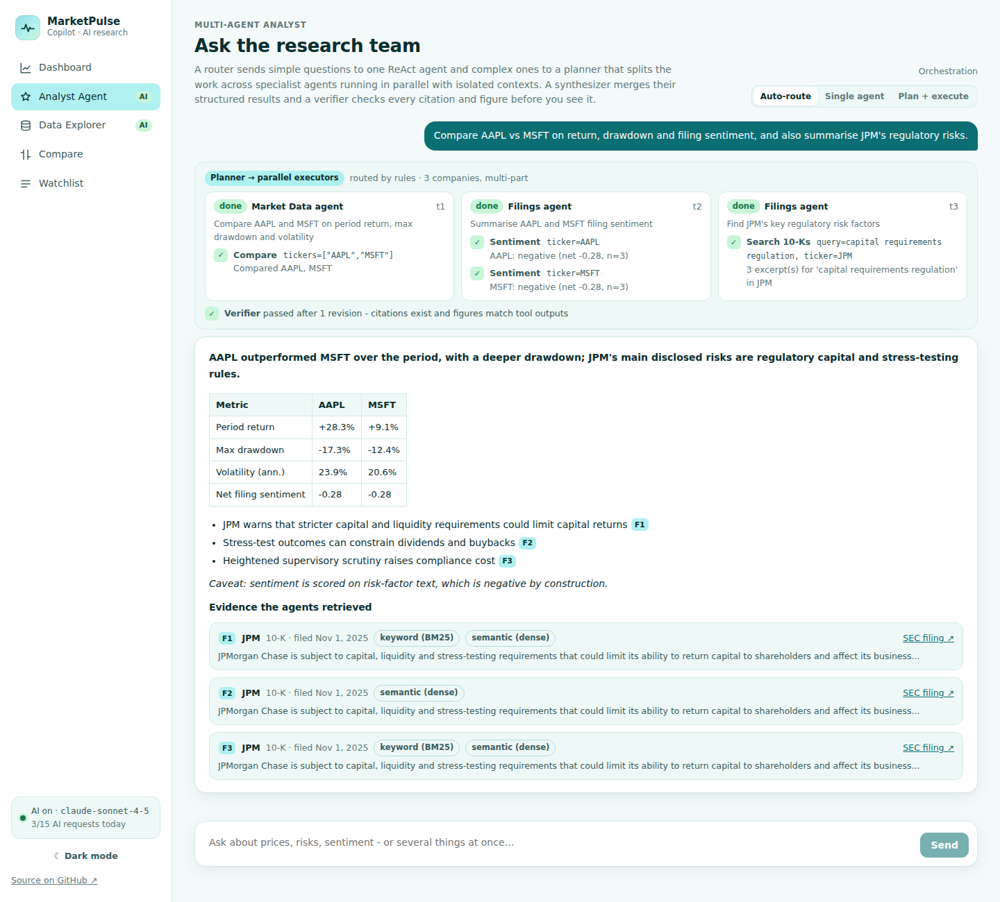
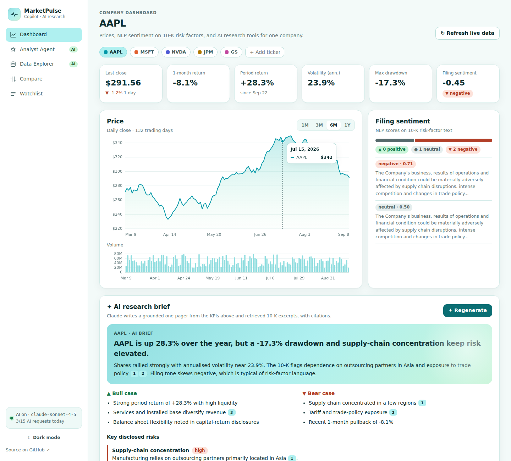
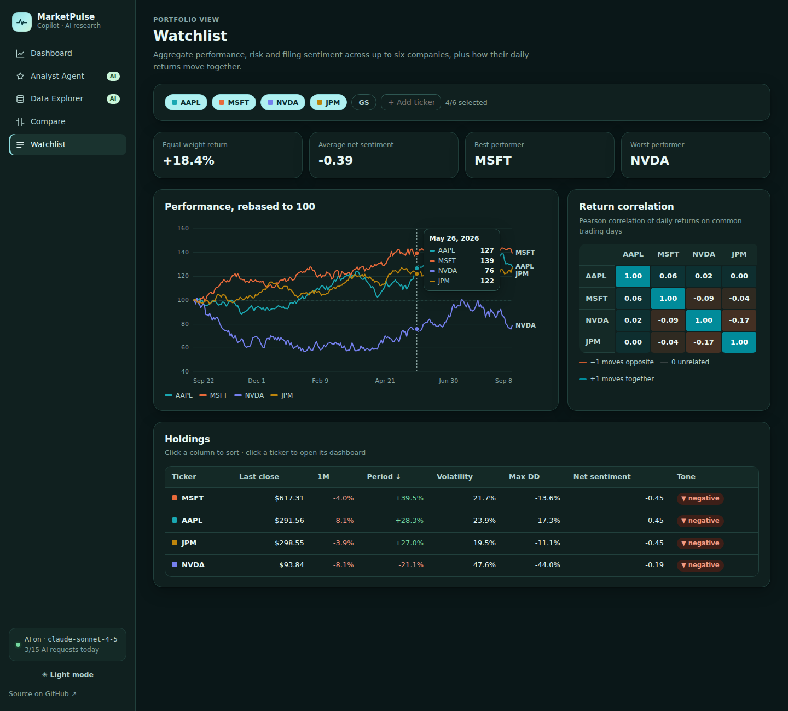
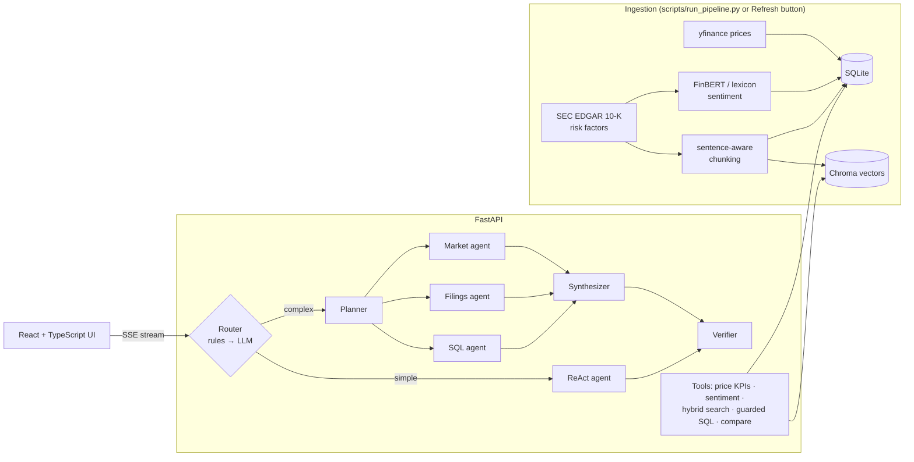

# MarketPulse Copilot

**A multi-agent LLM research workspace for public-market analysis.** Ask a question in plain English and a team of Claude-powered agents plans the work, pulls prices, queries SQL, searches SEC 10-K risk factors with hybrid retrieval, and returns a cited, fact-checked answer. The results appear in a React dashboard.

> Successor to [MarketPulse AI](https://github.com/H-yz2022/marketpulse-ai) (Streamlit). This version rebuilds the app as a **FastAPI + React** product and adds agentic AI, NL→SQL, hybrid RAG and production guardrails.


<p align="center"></p>

<details><summary>More screenshots (dashboard, watchlist, dark mode)</summary>




*Screenshots use synthetic demo data.*
</details>

| Page | What it shows |
|---|---|
| **Dashboard** | KPIs (return, volatility, drawdown), price and volume charts from 1 month to 10 years, **versus-the-market card** (beta, R², alpha, capture ratios vs an index), **key statistics** (valuation, growth and margins, trading activity, technicals, analyst targets, ownership) and reported insider trades, NLP filing sentiment, an **AI research brief** (bull/bear case, key risks with citations), and **Ask the filings** (hybrid RAG) |
| **Analyst Agent** | **Multi-agent orchestration** with a live trace: router → planner → parallel specialist agents → synthesizer → verifier |
| **Data Explorer** | **Natural language → SQL**: Claude writes the query, a 4-layer guard runs it read-only, and the results come back as a chart and table. Failed queries get one self-correction |
| **Compare** | Up to six companies against an index: rebased performance, risk/return scatter, 20+ metrics (Sharpe, Sortino, VaR/CVaR, beta, alpha, tracking error, up/down capture) with the best per row highlighted, a side-by-side **company detail** table (valuation, profitability, trading and flows, technicals, ownership), buying vs selling pressure, insider trades, yearly returns, relative strength, rolling beta, drawdowns, correlation, plus an **AI comparison of disclosed risk factors** for any two |
| **Watchlist** | A weighted buy-and-hold portfolio vs a benchmark: editable weights, portfolio Sharpe/beta/drawdown, **risk contribution** per holding, diversification ratio, a tabbed holdings table (risk, valuation, growth, trading & flows, technicals & analysts, ownership & insiders), look-through P/E, yield and sector mix, **buying vs selling pressure** (up/down-day volume, Chaikin Money Flow, liquidity), insider buying vs selling, risk/return scatter, correlation, drawdowns, rolling beta, and **yearly** (10-year, with CAGR) or monthly returns |
| **Markets** | Index ETFs as the market reference (S&P 500, Nasdaq-100, Dow, Russell 2000, tech and financials sectors): index scorecard with fees and valuation, correlations, yearly returns, and each company's **systematic vs company-specific risk** |

## Architecture



### How the agent system works (`src/marketpulse/llm/`)

1. **Router** (`orchestrator.route`) decides with **rules first**: ticker count, multi-intent words, compare words. Only ambiguous questions pay for a cheap LLM classification call.
2. **Simple question → one ReAct agent** (`agent.run_agent`). This is Claude native tool use in a loop. Planning a one-hop question would only add latency and cost.
3. **Complex question → Planner** emits a JSON task DAG (at most 4 tasks, each assigned to a specialist agent). The DAG is validated: unknown agents are remapped and forward or cyclic dependencies are dropped.
4. **Executors run in parallel** (in waves, following the dependencies). Each one has an **isolated context**: its own sub-goal, a **restricted tool subset**, and the **structured results** of any tasks it depends on. Executors never see each other's transcripts.
5. **Synthesizer** merges the task results into one answer. Failed tasks are reported as missing, and the request still completes.
6. **Verifier** checks the answer deterministically. Every `[F#]` citation must exist, and every figure must appear in a real tool output. If a check fails, the synthesizer gets one revision with the findings.

**Guardrails in the agent loop:** a step budget, **loop detection** (an identical tool call with the same arguments is not re-executed, and repeated loop hits end the run), **tool timeouts with one retry** for transient errors, errors for unknown tools or bad arguments that the model can recover from, read-only tools, and truncated tool output.

### Hybrid RAG (`src/marketpulse/rag/`)

`10-K HTML → Item 1A extraction (last header, skipping the ToC) → sentence-aware 800/100 chunks → Chroma embeddings + SQLite mirror → query rewrite → dense + BM25 for the original and rewritten queries → Reciprocal Rank Fusion → cited answer`

- The **original query is always searched**, so a bad rewrite can only add candidates. It can never hide the results the user's own words would have found.
- **BM25 catches exact or rare tokens** that embeddings blur ("CHIPS Act", "Rule 10b5-1", product names). **Dense retrieval catches paraphrases.** RRF fuses the two without having to calibrate their very different score scales.
- `scripts/eval_retrieval.py` measures **Recall@k and MRR** for BM25 vs dense vs hybrid across chunk sizes and overlaps. Use it to tune chunking settings instead of guessing them.

### NL→SQL safety (`src/marketpulse/llm/sql_guard.py`)

Four independent layers: (1) static checks (one statement, SELECT/WITH only, no write/DDL/PRAGMA keywords, with string literals stripped first); (2) a SQLite `mode=ro` connection; (3) an **authorizer callback** that allows only the public tables and denies `sqlite_master`, internal tables and recursive CTEs, even inside sub-queries; (4) a time limit via the progress handler and a row cap.

### Built-in snapshot + live refresh

The repo ships a small **snapshot dataset** (`seed/marketpulse_seed.json.gz`: 10 years of daily prices for the companies and index ETFs, their fundamentals and insider-trade summaries, plus the latest three 10-K risk-factor sections per ticker). On first start with an empty database the app restores it in seconds, so a fresh clone or deploy is usable immediately. Keyword (BM25) search works at once. The snapshot also ships each chunk's embedding, and Chroma plus the embedding model load only on the first semantic query, so an idle server stays around 50 MB and fits a 512 MB free-tier instance. **Refresh live data** on any ticker replaces its snapshot with real-time prices and filings, and a badge on the dashboard shows which source you're looking at. To regenerate the snapshot: `python scripts/export_seed.py`.

### Cost and abuse controls

Every billed endpoint checks a **per-client and a global daily cap** (persisted in SQLite) *before* calling the Anthropic API. If AI is disabled (no key), the endpoint returns 503 and no quota is consumed.

## Mapping to AI / Data Science internship skills

| Skill | Where it lives |
|---|---|
| LLMs & Generative AI | Multi-agent orchestration, tool use, structured JSON outputs, grounded briefs |
| NLP | FinBERT sentiment (lexicon fallback), 10-K section extraction, BM25 tokenization |
| RAG / retrieval | Chunking, Chroma embeddings, BM25, RRF, query rewrite, retrieval eval harness |
| SQL, BI & data viz | NL→SQL, portfolio and risk analytics (beta, alpha, R², VaR/CVaR, Sharpe/Sortino, risk contribution, rolling beta), dashboards, heatmaps |
| Cloud & production | Docker multi-stage build, Render blueprint, CI (lint, 60+ offline tests, frontend build, Docker build), rate limits |
| Market data / fintech | yfinance, SEC EDGAR full-text search API |

## Quickstart

**Requirements:** Python 3.10+, Node 20+, and an [Anthropic API key](https://console.anthropic.com/) (optional; without one, everything except the AI features still works).

```bash
git clone https://github.com/H-yz2022/marketpulse-copilot.git
cd marketpulse-copilot

# Backend
python -m venv .venv
source .venv/bin/activate            # Windows: .venv\Scripts\activate
pip install -r requirements-dev.txt
cp .env.example .env                 # Windows: copy .env.example .env   -> then add your keys
uvicorn marketpulse.api.main:app --reload --app-dir src     # http://localhost:8000/docs
# First start loads the built-in snapshot in seconds - no data download needed.
# Optional: pull real-time data from the CLI instead of the "Refresh live data" button:
#   python scripts/run_pipeline.py --ticker AAPL MSFT JPM NVDA GS

# Frontend (second terminal)
cd frontend
npm install
npm run dev                          # http://localhost:5173
```

**One container:** `docker build -t marketpulse-copilot . && docker run -p 8000:8000 --env-file .env marketpulse-copilot` serves the API and the built UI at http://localhost:8000.

**Deploy (free):** push to GitHub, then on [Render](https://render.com) choose **New → Blueprint** and pick this repo (`render.yaml`). Set `ANTHROPIC_API_KEY` and `SEC_USER_AGENT` in the dashboard. On first boot the app loads the built-in snapshot, so the site is usable right away.

## Tests

```bash
pytest -v        # fully offline: a scripted fake LLM client + fake retriever
ruff check src tests scripts
cd frontend && npm run build   # type-check + production build
```

The tests cover the router (rules vs LLM fallback), plan validation and DAG waves, parallel executors with context isolation, the verifier, loop detection, tool timeouts and retries, tool restriction, the SQL guard (injection and internal-table attempts), text-to-SQL self-repair, BM25, RRF, hybrid retrieval with query rewrite, rate limits and every API route.

## Project layout

```
src/marketpulse/
  api/          FastAPI app, rate limiting
  llm/          agent loop, orchestrator (router/planner/executors/synthesizer/verifier),
                text-to-SQL + SQL guard, briefs & comparisons, Anthropic client wrapper
  rag/          chunking + Chroma (pipeline.py), BM25 + RRF + query rewrite (hybrid.py)
  ingestion/    yfinance prices, SEC EDGAR filings
  nlp/          FinBERT / lexicon sentiment
  analytics.py  returns, volatility, drawdown, correlation, watchlist
frontend/src/   React + TypeScript UI (dependency-free SVG charts)
scripts/        run_pipeline.py, export_seed.py, load_seed.py, eval_retrieval.py, reset_data.py
seed/           built-in snapshot dataset loaded on first start
docs/           ARCHITECTURE.md: design decisions and trade-offs
```

## Limitations and next steps

- The sentiment model scores *risk-factor* text, which is negative by construction. The next step is to add earnings-call transcripts or news for a more balanced signal.
- A cross-encoder reranker after RRF would improve precision. Contextual chunk headers ([Anthropic's "contextual retrieval"](https://www.anthropic.com/engineering/contextual-retrieval)) would improve recall.
- The verifier checks facts deterministically but not reasoning. An LLM-as-judge pass and an offline eval set for answers are the next layer.

*Research tooling, not investment advice.* MIT licensed.
